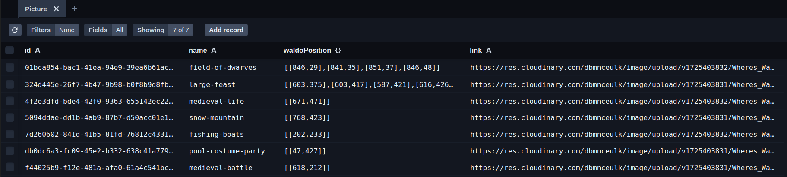
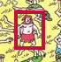
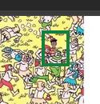

# Where-s-Waldo

- store waldo images in the backend with Prisma and Cloudinary
  

- logic is through px coordinates with `naturalWidth` and `pageXOffset`: if the user finds waldo, there will be a green mark, otherwise a red one

Future ideas:

- better quality images
